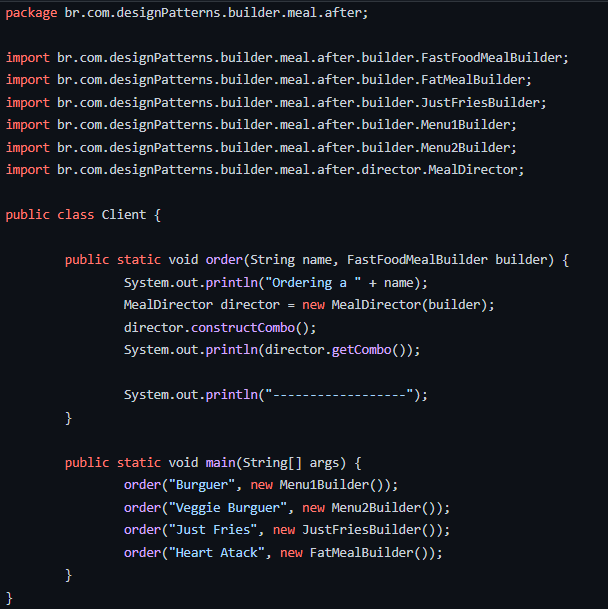
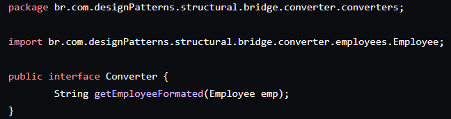

# O que são padrões?
> Cada padrão descreve um problema que ocorre frequentemente em seu ambiente, e então descreve o cerne da solução para aquele problema, de um modo tal que você pode usar esta solução milhões de vezes, sem nunca fazer a mesma coisa repetida.
# Padrões de Projetos Criacionais
> Existem diversos mecanismos para criar um objeto. Ao invés de utilizar diretamente o operador "new". Podemos utilizar  algum padrão que nos forneça mais flexibilidade no código.

## Factory Method

> Um padrão que define uma interface para criar um objeto. mas permite as classes decidirem qual classes instanciar. O factory Method permite a uma classe deferir a instanciação para subclasses.

> Nesse padrão temos 3 formas para trabalhar sendo o Factory, HalfSimple e Simple.

### Exemplo utilizado

> Em todos os exemplos apresentados para factory method serão utilizados a Classe abstrata Iphone e as classes
> concretas Iphone11, Iphone11Pro, IphoneX, IphoneXSMax.

* Classes

* Classe abstrata: Iphone

* Exemplo das classes concretas: iphone11

### Sem aplicar padrões

> Sem utilizar os padrões temos a classe genérica [IPHONE](https://github.com/Matheus-Reinert/design-patterns/blob/master/src/main/java/br/com/designPatterns/factory/apple/before/model/IPhone.java) 
> que possui apenas o método getHardware() abstrato pois para cada tipo de iphone será utilizado um hardware diferente.
>
> Teremos tanto uma classe abstrata que representa o objeto de forma genérica como teremos as classes concretas que estendem iphone
> e possuem um único método abstrato para definir os seus respectivos hardwarers.
> 
> No cliente será necessário importar todas as classes e instância-la de acordo com o iphone que deverá ser criado.

### Factory

> Diferente do exemplo anterior nesse modelo teremos 4 factorys concretas e uma factory abstrata
> Na iphoneFactory teremos um método para criar um novo iphone e nosso factoryMethod responsável por instanciar um novo iphone.

 
> Basicamente, cada tipo de iphone possuirá uma factory.

> No cliente de acordo com o objeto iphone que deve ser criado, deverá instanciar sua factory expecífica,
> Ao invés de ter uma relação direta com cada classe concreta de tipo iphone, se te uma relação direta com cada
> factory específica.

### HalfSimple

> No halfSimple será utilizado um parâmetro para dizer qual modelo específico da factory que deve ser criado.
> diminuindo a quantidade de factorys por modelo. Nesse padrão ao invés de  termos uma factory para cada objeto Iphone11, Iphone11Pro, IphoneX e IphoneXSMax. 
> Teremos um factory para iphones 11 e uma para iphones X.

* Iphone factory com parâmetro 

* Iphone X factory

* Iphone 11 factory

> No cliente de acordo com o parâmetro passado será criado o objeto.

### Simple

> No Simple temos agora uma classe concreta IphoneSimpleFactory que receberá a geração e o modelo
> do iphone para que o objeto seja criado.

* IphoneSimpleFactory

> Dessa forma no Cliente é necessário apenas conhecer a classe mais genérica de iphone e a factory

* Cliente

# Abstract Factory

> É utilizada em uma família de objetos, onde existem interfaces diferentes mas que estão relacionadas dentro de uma 
> funcionalidade do sistema.
>
> No exemplo utilizado teremos a criação de um iphone, seus certificados e empacotamento por país.
> Dessa forma, levamos em consideração que certificados e empacotamento são uma família que estarão relacionados.
>

* Estrutura da Abstract Factory

* Exemplo de classe abstrata Iphone 

* Exemplo de classe concreta Iphone

* Exemplo de interface Empacotamento 

* Exemplo de classe concreta Empacotamento

* Exemplo de interface Certificado 

* Exemplo de classe concreta Certificado

> Utilizaremos ainda um pouco do que foi aprendido anteriormente introduzindo as Factorys por iphone no modelo HalfSimple.
> Teremos as factorys de iphone 11, iphoneX e a classe abstrata IphoneFactory que receberão por parâmetro a regra utilizada pelo país

* Iphone factory

* IphoneX Factory
  

> Agora chegamos nas AbstractFactorys que englobam as regras de cada país

* Interface Regras do País 

* Classe concreta de regras no Brasil
  

> No cliente é necessário instanciar apenas a regra do país desejado e após isso
> criar o iphone com a regra desejada. Dessa forma se surgissem novos países era apenas 
> necessário criar suas regras de empacotamento, certificado e criar sua abstractFactory.

* Cliente

# Singleton

> Garantir que uma classe só tenha uma única instância, e prover um ponto global de acesso a ele.

### Exemplo

> O exemplo utilizado será de ConnectionPool onde para cada instância uma conexão com o banco é criada,
> porém mesmo colocando um limite de conexões, para cada novo objeto de conexão criada será gerado um novo objeto
> com a mesma quantidade de limite do anterior, dessa forma o limite acaba sendo por instância e não geral do objeto.

* ConnectionPool

* Connection

> Dessa forma, mesmo colocando o limite de conexões de POOL_SIZE = 2 será possível
> fazer quantas conexões o cliente quiser.

* Cliente

### Aplicação do Singleton

> Para ter um limite de conexões.
> A classe terá um atributo privado e estático para criar o Objeto da classe
> e um método getInstance() para devolver essa instância criada

* ConnectionPool

* Connection

> Para criar o objeto será necessário utilizar o getInstance() fazendo com que todas
> conexões possam ser gerenciadas por uma unica instanciação. A 3* conexão só será criada
> à partir do momento que uma das duas primeiras seja encerrada utilizando o método leaveConnection()

* Cliente

## Monostate

> O monostate possui a mesma função do singleton porém com ele é possível usar interfaces.
> O Construtor do connectionPool passa a ser público e o atributo de connections passa a ser estático
> fazendo com que o atributo seja um valor padrão e compartilhado em todas instâncias.

* ConnectionPool

> O maior problema do monostate é que caso você não seja a pessoa que criou classe,
> talvez não fique tão claro que o atributo é global para as instâncias.

* Cliente

## Builder

> Separar a construção de um objeto complexo de sua representação para que o mesmo processo de construção
> possa criar representações diferentes. Esse padrão serve para caso que temos muitos atributos e surge a necessidade de ter
> vários construtores

### Exemplo

> Em nosso exemplo temos um fast food no qual tem vários itens e vendas em combos diferentes.
> Dessa forma são necessários vários construtores.

* FastFood

> No cliente para cada pedido diferente é solicitado outro construtor.

* Cliente

### Aplicação Builder

> Com o padrão builder teremos os cardápios pré-definidos pelas classes.

* Estrutura builder

> Teremos então a classe principal Builder abstrata 

* Fast Food Builder

> Dessa forma todos as classes que estendem FastFoodMealBuilder deveram implementar seus
> métodos e aplicando a opção do cardápio escolhido

* Exemplo de cardápio

> Para gerenciar os construtores será criado uma classe Director responsável por
> gerenciar o builder, que ao receber o builder já terá acesso aos métodos para criarem o combo escolhido.

* Director

> No cliente será passado o builder para o director e a classe erá responsável por devolver
> o combo correto.

* Cliente

## Prototype

> Especificar os tipos de objetos a serem criados usando uma instância como protótipo e 
> criar novos objetos ao copiar este protótipo.

### Exemplo

> Para utilizar o protoype será mostrado um personagem que se move pela tela.
> Será usado a classe pessoas que possui os atributos de linhas do personagem,
> seus movimentos e o clone.

* Personagem 

> Na classe de amostra de personagens temos os personagens pré-definidos.

* Tipos de personagem

> No cliente a parte principal está nas movimentações pois para cada movimentação um
> objeto novo é criado e adicionado no frame da animação.

* Cliente

-----
# Padrões de Projetos Estruturais
> Objetos podem se unir em estruturas maiores. Porém de forma organizada, facilitando possíveis extensões

## Adapter

> Converter a interface de uma classe em outra interface esperada pelos clientes.
> Adapter permite a comunicação entre classes que não poderiam trabalhar juntas
> devido à incompatibilidade de suas interfaces.
> 
> Para exemplificar o adapter de maneira lúdica será utilizado as classes devices na qual
> Tv implementa a classe de HDMI e OldMonitor implementa a classe Vga. No caso de computer
> existe a composição de HDMI.
>
> O HDMI consegue transmitir imagem e aúdio e
> VGA só transmite imagem. 

* HDMI

* VGA

> A classe OldMonitor implementa a classe de Vga já a classe de TV Implementa HDMI

* TV

* OldMonitor
  

> No caso de Computer existe a composição com a interface HDMI

* Computer

> Agora chegamos no adapter, a primeira opção será o adapter de objeto

### Adapter com objeto

> HDMIToVGAAdapter trabalha tanto com herança quanto com composição
> Implementando a classe HDMI e tendo a composição com VGA.
> Dessa forma Herdara os métodos de HDMI e poderá utilizá-los para o VGA.

> No cliente poderá ser utilizado o "Adaptador" para conectar a porta

* Cliente

### Class Adapter 

> No Adaptador de classe HDMIToOldMonitorAdapter é herdado de OldMonitor
> e implementado HDMI. Possuindo o método setImage herdado de OldMonitor e
> o método setSound herdado de HDMI.
> 
> No Cliente o objeto resultante de HDMIToOldMonitorAdapter pode
> ser passado como parâmetro para conectar a porta.

## Bridge

> Desacoplar uma abstração de sua implementação para que os dois possam variar independentemente.

### Exemplo

> No exemplo temos uma classe de empregados e a necessidade de exportá-los, seja para csv, json,
> ou qualquer outro tipo. Possuímos dois lados da ponte que devem ser interligados o tipo do empregado
> e sua forma de exportação. 
> 
> Se for separar esses itens por classe seria algo parecido com : 
> ITGuyToCSV, ProjectManagerToCSV, ITGuyToJson, ProjectManagerToJson. Dependendo da quantidade de classes
> de empregados e de tipos de formato a quantidade de classes para converter seriam grandes.

> A interface Employee e suas classes extendidas não possuem nada demais.

* Employee

* ITGuy

* ProjectManager

> O Segredo está na interface que será implementada pelos conversores,
> pois nela é passado por parâmetro o objeto Employee que deve ser convertido.

* Converter

* Csv converter

* Json converter

* Cliente 

## Composite

> Compor o objeto em estrutura de árvore para representar hierarquia todo-parte. 
> Composite permite que clientes tratem objetos individuais e composições de 
> objeto de maneira uniforme.

### Exemplo

> O Exemplo utilizado é de um pequeno sistema de pastas e  arquivos onde uma pasta pode ter 
> mais pastas filhas e arquivos filhos de forma que tornará uma árvore de hierarquia.
>
> Para tal exemplo será utilizado a interface de FileSystemItem que possui o método para
> printar a estrutura.

* FileSystemItem

> A classe Folder implementa a classe FileSystemItem e possui uma lista de filhos
> que pode ser tanto pastas como arquivos. Trabalhando com a mesma interface tanto para
> File quanto para Folder seria como termos Nós que são a pasta e folhas sendo pastas ou arquivos.
> Não precisando se preocupar com qual filho estamos empregando para o Pai.

* Folder

> Pelo File ser mais simples e ser a folha na estrutura final, receberá apenas nome e 
> implementará a interface FileSystemItem.

* File

> No cliente fica mais claro essa recursividade pois é possível ter um nó com vários filhos 
> nós e no final posssuir uma folha.

* Cliente

## Decorator

> Anexar responsabilidades adicionais a um objeto dinamicamente. Decorators oferecem uma alternativa flexível 
> ao uso de herança para estender uma funcionalidade.
> 
> Podemos herdar apenas de uma classe ou implementar mais de uma classe mas com o decorator
> é possível acrescentar novas funcionalidades a um objeto de forma dinâmica via composição.

### Exemplo

> Teremos uma cafeteria que vende café expresso, e chá. Porém também é possível pedir esses drinks
> com leite ou doubleDrink. Para não criar classes ExpressoMilk, ExpressoDoubleDrink, TeaMilk, TeaDoubleDrink. 
> Pode-se utilizar o decorator podendo criar objeto com as classes concretas de drinks com os decorators.

> Na interface Drink possui os métodos serve() e getPrice() que são implementados por Expresso e Tea.

* Drink

* Expresso

* Tea

> A classe abstrata DrinkDecorator implementa Drink, por ser uma classe abstrata não implementa os métodos de Drink.
> Para criar a composição temos o atributo Drink que será utilizado para adicionar novas funcionalidades respeitando a
> mesma interface.

* Drink Decorator

> Tanto DoubleDrink quanto Milk extendem DrinkDecorator e receberão o Drink em seu construtor.À partir disso
> o Objeto passado receberá seu novo preço e quantidade.

* Milk

* Double Drink

> No cliente é passado apenas o objeto de Drink para seu decorator caso seja uma bebida "especial".

* Cliente

## Facade

> Oferece uma interface única para um conjunto de interfaces de um subsistema. Façade define uma 
> interface de nível mais elevado que torna o subsistema mais fácil de usar.

### Exemplo antes

> Em um sistema de cartão de crédito o cliente tendo acesso a todas classes para manipulação dificulta alterações,
> pois todos os clientes que usam o sistema utilizaram todos serviços. Temos então um alto acoplamento e
> dificuldade para evoluir o código.

> Antes de aplicar o facade temos as classes de Cartão e Registro.

* Card

* Register

> E suas classes de serviço.

* Services

> Mas a parte importante desse código é mostrar que o cliente tem acesso a todos os serviços sem
> ter uma fachada.Isso gera uma complexidade muito  maior.

* Cliente

### Exemplo depois

> Agora com o facade implementado o Cliente acessa todos serviços à partir da Fachada, se for necessário
> qualquer alteração no modelo de negócio pode ser manipulado direto na fachada correndo menos riscos de impactar
> no cliente.

* CallCenterFacade

* Cliente

## FlyWeight

> Usar compartilhamento para suportar grandes quantidades de objetos refinados eficientemente.

> Então no objeto temos valores  intrínsecos e extrínsecos, os intrínsecos são valores que não modificam
> e extrínsecos são valores diferentes para cada objeto.

> É uma padrão voltado para "cache" de forma a consumir a memória de forma melhor. 

### Exemplo antes

> Teremos um musicPlayer onde name, artist e durationInSecond são intrínsecos, ou seja, não iram variar.

* Music

> Dessa forma ao tocar 2 músicas iguais para 2 pessoas diferentes tenho 4 músicas na memória.

* Cliente

### Exemplo depois

> Agora a música recebe uma composição de flyweight pois os valores intrínsecos serão compartilhados com
> todos usuários.

* Music

* MusicFlyweight

> Foi criado uma Factory para controlar as instâncias das músicas utilizando singleton. Toda música gerada 
> passa pelo que getMusic, se ela não tem uma instância criada, será criada uma nova.

* MusicFlyweightFactory

> No service ao tentar pegar a música da playlist do usuário, se ela não existir será passado a instância
> de FlyWeightFactory, ou seja os dados que são repetidos serão usados para todos usuários.

* MusicService

> No cliente a quantidade de músicas na memória é reduzida.

* Cliente

## Mediator

> Definir um objeto que encapsula como um conjunto de objetos interagem. Mediator promove acoplamento fraco
> ao manter objetos que não se referem um ao outro explicitamente, permitindo variar suas interações de forma
> independente;

### Exemplo

> O mediator serve para comunicação de objetos de uma ponta com outra.
>
> No exemplo de chat e tradução onde usuários de um país fazem comunicação com outro temos 
> a classe abstrata de User, PortugueseUser e EnglishUser que extendem de User e Enum Language.

* User

* EnglishUser

* PortugueseUser

* Language

> No Mediator que é feito a comunicação entre os usuários, é uma classe abstrata que será extendida
> por ChatMediator e TranslatorMediator. 

* Mediator

* ChatMediator

* TranslatorMediator

> Dependendo da instância utilizada o mediator irá traduzir ou não a mensagem no Cliente.

* Cliente

## Proxy

> Prover um substituto ou ponto através do qual um objeto possa controlar o acesso a outro.

### Exemplo

> Teremos um exemplo de banco onde o Cliente poder ter acesso ao banco e também ao caixa eletrônico
> alguns comportamentos serão diferentes desses dois objetos, porém funcionam da mesma forma. O caixa eletrônico
> será o proxy nesse caso.

* User

> BankOperations é a interface que será implementada tanto por ATM quanto para Bank.

* BankOperations

* Bank

> No caixa eletrónico ATM, ao invés de ter seus próprios métodos criados, ele terá uma composição com bank
> e dessa forma é possível delegar algumas responsabilidades diretas para bank.

* ATM

* Client

# Padrões de Projetos Comportamentais
> Organizar a forma de comunicação entre os objetos.
